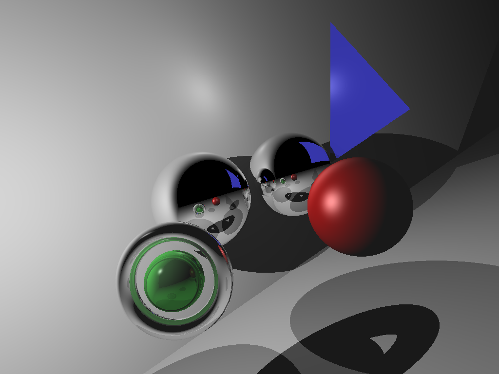

# raytracer

A simple ray tracer in C++23.

## Example Scene
Compiling `src/example.cpp` and running it will output a NetPBM image under `test.pbm`.

### Without SSAA

### With SSAA:
By adding `-DENABLE_SSAA` to the compiler flags will enable grid SSAA.

